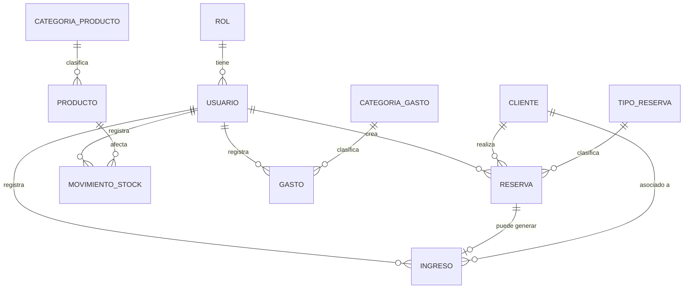

# Planificación CRM Bodega — MVP

---

## 1. Resumen ejecutivo

**Problema que resuelve:** hoy la información operativa de la bodega (reservas de degustaciones y restaurante, clientes, stock, gastos e ingresos) probablemente vive dispersa en planillas, cuadernos o la memoria del dueño. Esto dificulta saber, en un momento dado, cuántas personas vienen hoy, qué productos están por agotarse o cuál es el balance del mes. El CRM centraliza esa información en un solo sistema web.

**Quiénes lo usarán:**
- **Dueño/administrador**: visión general del negocio, control total.
- **Empleados**: uso operativo diario (cargar reservas, clientes, movimientos de stock, gastos/ingresos según permiso).

**Qué incluye el MVP:** dashboard con indicadores clave, gestión de reservas (restaurante y degustaciones), clientes, productos/vinos, stock por movimientos, gastos, ingresos/ventas simples, y administración básica de usuarios con dos roles.

**Qué NO incluye el MVP:** facturación electrónica, integraciones de pago, notificaciones automáticas (WhatsApp/email), contabilidad completa, gestión de producción/viñedos, app móvil nativa, IA, reportes predictivos. Todo esto queda documentado como evolución futura, sin bloquear la arquitectura.

---

## 2. Supuestos funcionales

| # | Problema / ambigüedad | Decisión propuesta | Motivo |
|---|---|---|---|
| 1 | Capacidad máxima por horario de degustación | Configurable por tipo de reserva, valor por defecto 20 personas por turno | Permite ajustarlo sin tocar código; 20 es razonable para una bodega chica-mediana |
| 2 | Duración de una degustación | Fija en 90 minutos por defecto, editable en configuración | Simplifica el cálculo de solapamiento de turnos |
| 3 | Disponibilidad de mesas del restaurante | En el MVP no se modela mesas individuales, solo capacidad total de comensales por franja horaria (configurable, ej. 40 personas) | Modelar mesas físicas es complejidad de un sistema de reservas de restaurante completo; no es imprescindible para el MVP |
| 4 | Reservas simultáneas / superposición | El sistema valida que la suma de personas en un turno no supere la capacidad configurada, pero no bloquea duro: muestra advertencia y permite forzar (el empleado puede decidir) | El dueño puede querer hacer excepciones (evento especial); bloquear duro genera fricción |
| 5 | Manejo de cancelaciones | Cambia el estado a "Cancelada", no se elimina el registro, libera cupo | Trazabilidad e histórico para reportes futuros |
| 6 | Stock negativo | No se permite: una salida de stock que deje el total en negativo se rechaza con error claro | Evita datos inconsistentes; el dueño prefiere detectar el problema antes que "arrastrar" un negativo |
| 7 | Registro de ventas | En el MVP, "venta" es un movimiento de stock (salida) + opcionalmente un registro de ingreso asociado; no hay carrito ni facturación | Cubre la necesidad real sin construir un POS completo |
| 8 | Diferencia entre ingresos y ventas | "Ingreso" es el registro financiero (dinero que entra); "venta" es el movimiento de stock que puede o no generar un ingreso asociado (ej. consumo interno no genera ingreso) | Separar dinero de inventario da flexibilidad y es más simple de mantener consistente |
| 9 | Permisos de empleados | Todos los empleados tienen el mismo set de permisos en el MVP (reservas, clientes, stock, gastos/ingresos), sin permisos granulares por persona | Piden explícitamente no complejizar permisos ahora; queda preparado el modelo de roles para extenderlo |
| 10 | Clientes duplicados | Se advierte si ya existe un cliente con el mismo email o teléfono al crear uno nuevo, pero no se bloquea | Evita fricción operativa sin perder prevención de duplicados |
| 11 | Eliminación de registros | No hay borrado físico de reservas, clientes, productos, gastos o ingresos; se usa baja lógica (`activo`/`estado`) | Trazabilidad y auditoría básica |
| 12 | Zona horaria / moneda | Zona horaria única del negocio (configurable, default `America/Argentina/Buenos_Aires`), moneda única ARS | Bodega argentina, un solo local; multi-moneda es innecesario para el MVP |

---

## 3. Priorización del MVP

**Imprescindible para el MVP**
- Autenticación con roles (dueño / empleado)
- Dashboard básico (reservas del día, próximas, ingresos/gastos del período, stock bajo)
- CRUD de reservas (restaurante y degustación) con estados y confirmación de asistencia
- CRUD de clientes con historial de reservas
- CRUD de productos/vinos con stock actual calculado
- Movimientos de stock (ingreso, venta, consumo interno, pérdida, ajuste)
- Registro de gastos
- Registro de ingresos
- Gestión básica de usuarios (alta por parte del dueño)

**Conveniente para el MVP**
- Filtros y búsqueda avanzada en tablas (por fecha, estado, categoría)
- Observaciones/preferencias de clientes
- Alertas visuales de stock mínimo en dashboard
- Exportar listados simples (CSV) — si el tiempo lo permite

**Versión futura**
- Facturación electrónica e integración fiscal
- Pagos online / Mercado Pago
- Notificaciones automáticas (WhatsApp, email)
- Adjuntar comprobantes a gastos
- Gestión de mesas físicas del restaurante
- Permisos granulares por usuario
- Reportes avanzados / predictivos
- Gestión de producción de vino y viñedos
- App móvil nativa

---

## 4. Historias de usuario

### Autenticación
**HU-01** Como usuario del sistema, quiero iniciar sesión con email y contraseña, para acceder a las funciones según mi rol.
- Criterios: login rechaza credenciales inválidas con mensaje claro; sesión expira tras un tiempo configurable; tras login exitoso redirige al dashboard.

**HU-02** Como usuario, quiero cerrar sesión, para proteger el acceso al sistema.
- Criterios: botón de logout visible; al cerrar sesión se invalida el token y redirige a `/login`.

### Dashboard
**HU-03** Como dueño, quiero ver un resumen del día al entrar al sistema, para tomar decisiones rápidas.
- Criterios: muestra reservas del día, personas esperadas, ingresos y gastos del período, productos con stock bajo, últimos movimientos. Estado de carga y estado vacío contemplados.

### Reservas
**HU-04** Como empleado, quiero crear una reserva de restaurante o degustación, para registrar la visita de un cliente.
- Criterios: formulario pide tipo, fecha, hora, cantidad de personas, cliente (existente o nuevo), observaciones; valida capacidad del turno; guarda con estado "Pendiente".

**HU-05** Como empleado, quiero confirmar una reserva, para indicar que el cliente confirmó su asistencia.
- Criterios: cambia estado a "Confirmada"; solo posible desde "Pendiente".

**HU-06** Como empleado, quiero registrar la asistencia de una reserva, para saber quién efectivamente vino.
- Criterios: cambia estado a "Completada"; solo disponible el día de la reserva o posterior.

**HU-07** Como empleado, quiero cancelar una reserva, para liberar el cupo si el cliente avisa que no viene.
- Criterios: pide confirmación; cambia estado a "Cancelada"; libera cupo del turno.

**HU-08** Como empleado, quiero marcar una reserva como "No asistió", para llevar registro de ausencias.
- Criterios: disponible solo después de la fecha/hora de la reserva.

**HU-09** Como empleado, quiero ver las reservas por día, semana o mes, para organizar la operación.
- Criterios: vista con filtro de rango de fechas y tipo de reserva; tabla ordenable.

### Clientes
**HU-10** Como empleado, quiero registrar un cliente nuevo, para asociarlo a una reserva.
- Criterios: nombre y apellido obligatorios; valida formato de email si se completa; advierte si ya existe un cliente con mismo email/teléfono.

**HU-11** Como empleado, quiero ver el historial de reservas de un cliente, para conocer su relación con la bodega.
- Criterios: en la ficha del cliente se listan sus reservas ordenadas por fecha, con estado.

### Productos
**HU-12** Como dueño, quiero registrar un producto o vino, para gestionarlo en stock y ventas.
- Criterios: nombre, categoría y precio de venta obligatorios; stock inicial en 0 salvo que se cargue un movimiento de ingreso.

**HU-13** Como dueño, quiero marcar un producto como inactivo, para dejar de ofrecerlo sin borrar su historial.
- Criterios: producto inactivo no aparece en selectores de nuevas ventas, pero sí en reportes históricos.

### Stock
**HU-14** Como empleado, quiero registrar un ingreso de mercadería, para actualizar el stock disponible.
- Criterios: pide producto, cantidad, fecha, usuario responsable; suma al stock actual.

**HU-15** Como empleado, quiero registrar una salida de stock (venta, consumo interno, pérdida), para reflejar la realidad del inventario.
- Criterios: valida que no deje stock negativo; pide motivo si es pérdida o ajuste.

### Gastos
**HU-16** Como empleado con permiso, quiero registrar un gasto, para llevar control de egresos.
- Criterios: fecha, concepto, categoría e importe obligatorios; estado de pago (pagado/pendiente).

### Ingresos
**HU-17** Como empleado con permiso, quiero registrar un ingreso, para llevar control de lo facturado.
- Criterios: fecha, concepto, origen e importe obligatorios; cliente y reserva asociada opcionales.

### Usuarios
**HU-18** Como dueño, quiero crear usuarios empleados, para que puedan operar el sistema.
- Criterios: solo el dueño accede a esta pantalla; email único; contraseña con requisitos mínimos.

---

## 5. Flujos principales

**Crear una reserva**
1. Usuario entra a "Reservas" → "Nueva reserva".
2. Selecciona tipo (restaurante/degustación), fecha, hora, cantidad de personas.
3. Busca cliente existente o crea uno nuevo en el mismo formulario.
4. Sistema valida capacidad del turno; si se supera, muestra advertencia con opción de continuar.
5. Guarda con estado "Pendiente" y muestra confirmación.
- *Errores*: campos obligatorios faltantes, fecha en el pasado, cliente inválido.

**Confirmar reserva**
1. Desde el listado o ficha de la reserva, botón "Confirmar" (solo si estado = Pendiente).
2. Sistema pide confirmación y cambia estado a "Confirmada".

**Registrar asistencia**
1. Desde la ficha, botón "Marcar como completada" (habilitado desde la fecha de la reserva en adelante).
2. Cambia estado a "Completada".

**Cancelar reserva**
1. Botón "Cancelar" con modal de confirmación.
2. Cambia estado a "Cancelada", libera cupo del turno.

**Crear cliente**
1. Formulario con nombre, apellido y datos de contacto.
2. Sistema verifica duplicados por email/teléfono y muestra advertencia no bloqueante.
3. Guarda cliente.

**Registrar producto**
1. Formulario con nombre, categoría, precio, costo, stock mínimo.
2. Guarda producto con stock actual en 0.

**Registrar ingreso de stock**
1. Selecciona producto, cantidad, fecha.
2. Sistema suma la cantidad al stock actual y crea el movimiento.

**Registrar venta/salida de stock**
1. Selecciona producto, tipo de salida, cantidad.
2. Sistema valida stock suficiente; si no alcanza, muestra error y no permite continuar.
3. Descuenta del stock, crea el movimiento; si es venta, ofrece crear un ingreso asociado.

**Registrar gasto**
1. Formulario con fecha, concepto, categoría, importe, medio de pago, proveedor opcional.
2. Guarda el gasto.

**Consultar dashboard**
1. Al ingresar al sistema se cargan indicadores del período actual (por defecto, mes en curso).
2. Usuario puede cambiar el rango de fechas para recalcular indicadores.

---

## 6. Mapa de pantallas

1. **Login** — objetivo: autenticar al usuario. Info: formulario email/contraseña. Acciones: iniciar sesión. Errores: credenciales inválidas.
2. **Dashboard** — objetivo: resumen del negocio. Info: tarjetas de indicadores, tabla de reservas del día, alertas de stock bajo. Filtros: rango de fechas. Responsive: tarjetas se apilan en mobile.
3. **Listado de reservas** — objetivo: gestionar reservas. Info: tabla con fecha, cliente, tipo, personas, estado. Filtros: por fecha, tipo, estado. Botones: nueva reserva, ver/editar. Estado vacío: "No hay reservas para el rango seleccionado".
4. **Detalle/formulario de reserva** — objetivo: crear/editar reserva. Formulario con validaciones. Acciones: confirmar, cancelar, marcar asistencia.
5. **Listado de clientes** — objetivo: gestionar clientes. Tabla con nombre, contacto, cantidad de reservas. Filtros: búsqueda por nombre/email.
6. **Detalle de cliente** — objetivo: ver ficha completa. Info: datos de contacto, historial de reservas, preferencias.
7. **Listado de productos** — objetivo: gestionar catálogo. Tabla con nombre, categoría, stock actual, estado. Alertas: stock bajo mínimo resaltado.
8. **Detalle/formulario de producto** — objetivo: crear/editar producto.
9. **Movimientos de stock** — objetivo: ver histórico y registrar nuevos movimientos. Tabla con fecha, producto, tipo, cantidad, usuario. Filtros: por producto, tipo, fecha.
10. **Listado de gastos** — objetivo: gestionar egresos. Tabla con fecha, concepto, categoría, importe, estado de pago. Filtros: por fecha, categoría.
11. **Listado de ingresos** — objetivo: gestionar ingresos. Tabla con fecha, concepto, origen, importe. Filtros: por fecha, origen.
12. **Listado de usuarios** (solo dueño) — objetivo: administrar accesos. Tabla con nombre, email, rol, estado. Acciones: crear, desactivar.
13. **Configuración** — objetivo: parámetros generales (capacidad de turnos, duración de degustación, categorías). Solo dueño.

---

## 7. Navegación

Menú lateral: Dashboard, Reservas, Clientes, Productos, Stock, Gastos, Ingresos, Usuarios (solo dueño), Configuración (solo dueño).

Rutas:
- `/login` — pública
- `/dashboard` — protegida
- `/reservas`, `/reservas/nueva`, `/reservas/:id` — protegidas
- `/clientes`, `/clientes/nuevo`, `/clientes/:id` — protegidas
- `/productos`, `/productos/nuevo`, `/productos/:id` — protegidas
- `/stock` — protegida
- `/gastos`, `/gastos/nuevo` — protegidas
- `/ingresos`, `/ingresos/nuevo` — protegidas
- `/usuarios` — protegida, solo rol `owner`
- `/configuracion` — protegida, solo rol `owner`

Todas las rutas excepto `/login` requieren sesión válida; `/usuarios` y `/configuracion` requieren además rol de dueño.

---

## 8. Wireframes textuales

**Dashboard**
```
[Header: logo | nombre bodega | usuario | logout]
[Menú lateral]  [Filtro de rango de fechas]
  [Tarjeta: Reservas hoy] [Tarjeta: Personas esperadas]
  [Tarjeta: Ingresos período] [Tarjeta: Gastos período] [Tarjeta: Balance]
  [Tabla: Últimos movimientos de stock]
  [Lista: Productos con stock bajo]
```

**Listado de reservas**
```
[Header]
[Menú lateral] [Botón: + Nueva reserva]
  [Filtros: fecha desde/hasta | tipo | estado]
  [Tabla: Fecha | Hora | Cliente | Tipo | Personas | Estado | Acciones]
  [Estado vacío: "No hay reservas"]
```

**Formulario de reserva**
```
[Header]
[Menú lateral]
  [Form: Tipo (radio) | Fecha | Hora | Personas | Cliente (buscar/crear) | Observaciones]
  [Botones: Guardar | Cancelar]
  [Alerta si se supera capacidad del turno]
```

*(El mismo patrón de header + menú lateral + contenido con tabla/formulario/tarjetas aplica a Clientes, Productos, Stock, Gastos, Ingresos y Usuarios.)*

---

## 9. Modelo de datos (resumen de entidades principales)

- **Usuario**: id, nombre, email (único), password_hash, rol_id, activo, creado_en, actualizado_en.
- **Rol**: id, nombre (`owner`/`employee`), descripción.
- **Cliente**: id, nombre, apellido, teléfono, email, país/ciudad, observaciones, acepta_comunicaciones (bool), creado_en.
- **TipoReserva**: id, nombre (`restaurante`/`degustacion`), duración_minutos, capacidad_default.
- **Reserva**: id, tipo_reserva_id, cliente_id, fecha, hora, personas, estado, observaciones, creado_por, creado_en, actualizado_en.
- **CategoriaProducto**: id, nombre.
- **Producto**: id, nombre, categoria_id, varietal, cosecha, precio_venta, costo_estimado, stock_minimo, activo, creado_en. (stock_actual se calcula, no se almacena directo, o se mantiene como campo desnormalizado recalculado por trigger/servicio para performance).
- **MovimientoStock**: id, producto_id, tipo (`ingreso`/`venta`/`consumo_interno`/`perdida`/`ajuste`), cantidad, fecha, usuario_id, motivo.
- **CategoriaGasto**: id, nombre.
- **Gasto**: id, fecha, concepto, categoria_id, importe, medio_pago, proveedor, estado_pago, observaciones, creado_por.
- **Ingreso**: id, fecha, concepto, origen, importe, medio_pago, cliente_id (opcional), reserva_id (opcional), creado_por.

Todas las entidades incluyen `creado_en` y `actualizado_en`; borrado lógico mediante campo `activo` o `estado` según corresponda.

---

## 10. Relaciones entre entidades (Mermaid)



---

## 11. API REST (resumen por recurso)

**Auth**
- `POST /api/auth/login` — body: email, password → devuelve token. Rol: público.
- `POST /api/auth/logout` — Rol: autenticado.

**Reservas**
- `GET /api/reservas?desde=&hasta=&tipo=&estado=` — Rol: owner/employee.
- `POST /api/reservas` — crea reserva. Rol: owner/employee.
- `GET /api/reservas/:id`
- `PUT /api/reservas/:id`
- `PATCH /api/reservas/:id/confirmar`
- `PATCH /api/reservas/:id/cancelar`
- `PATCH /api/reservas/:id/completar`

**Clientes**
- `GET /api/clientes?buscar=`
- `POST /api/clientes`
- `GET /api/clientes/:id`
- `PUT /api/clientes/:id`

**Productos**
- `GET /api/productos?categoria=&activo=`
- `POST /api/productos`
- `PUT /api/productos/:id`

**Stock**
- `GET /api/movimientos-stock?producto_id=&tipo=&desde=&hasta=`
- `POST /api/movimientos-stock` — valida stock disponible en salidas.

**Gastos**
- `GET /api/gastos?desde=&hasta=&categoria=`
- `POST /api/gastos`

**Ingresos**
- `GET /api/ingresos?desde=&hasta=&origen=`
- `POST /api/ingresos`

**Usuarios**
- `GET /api/usuarios` — Rol: owner.
- `POST /api/usuarios` — Rol: owner.
- `PATCH /api/usuarios/:id/desactivar` — Rol: owner.

**Dashboard**
- `GET /api/dashboard?desde=&hasta=` — devuelve indicadores agregados.

Errores comunes en todos los endpoints: `400` validación, `401` no autenticado, `403` sin permiso, `404` no encontrado, `409` conflicto (ej. stock insuficiente).

---

## 12. Reglas de negocio (síntesis)

- Una reserva no puede crearse con fecha/hora en el pasado.
- El cambio de estado de reserva sigue el flujo: Pendiente → Confirmada → Completada, o cualquiera → Cancelada. No se puede volver de Completada/Cancelada a otro estado.
- El stock actual de un producto es siempre la suma de sus movimientos; no se edita manualmente.
- No se permite una salida de stock que deje el total en negativo.
- Los gastos e ingresos no se eliminan, solo pueden marcarse con un estado (ej. gasto anulado).
- Solo el dueño puede crear usuarios y acceder a configuración.
- La baja de clientes, productos y usuarios es lógica, no física.

---

## 13. Validaciones

- **Frontend**: campos obligatorios, formatos (email, números positivos), feedback inmediato antes de enviar.
- **Backend**: repite todas las validaciones del frontend (nunca confía solo en el cliente), además de reglas de negocio (capacidad, stock disponible, transiciones de estado válidas, unicidad de email).
- **Base de datos**: constraints de tipo (`NOT NULL`, `UNIQUE` en email), claves foráneas con integridad referencial, checks básicos (cantidad > 0).

---

## 14. Arquitectura propuesta

**Frontend**: SPA en React + Vite + JavaScript, React Router para rutas, Tailwind CSS para estilos, manejo de estado con Context API + hooks (sin Redux, innecesario para el MVP), llamadas a API centralizadas en una capa `services/`.

**Backend**: API REST recomendada en **Node.js con NestJS**. Comparación breve:
- *Express*: muy simple para arrancar, pero requiere armar a mano la estructura de capas (controlador/servicio/repositorio), lo que puede derivar en desorden si no hay disciplina.
- *NestJS*: ya impone una arquitectura modular (controllers, services, providers, DTOs con validación integrada vía `class-validator`), tiene inyección de dependencias, y facilita mucho el crecimiento futuro sin reescribir. La curva de entrada es un poco mayor que Express, pero se paga rápido en mantenibilidad.
- *Spring Boot*: robusto y probado, pero implica un stack más pesado (JVM) y mayor tiempo de configuración para un equipo/AI-agent que trabajará principalmente en JS/TS en el frontend; mezclar dos ecosistemas de lenguaje agrega fricción sin beneficio claro en este MVP.

**Recomendación: NestJS + TypeScript**, por la afinidad con el frontend (mismo lenguaje), estructura en capas ya integrada, y buen soporte para crecer hacia funcionalidades futuras sin reescritura.

**Base de datos**: PostgreSQL en producción; SQLite o PostgreSQL local en desarrollo. ORM recomendado: Prisma (migraciones simples, tipado end-to-end).

**Hosting de la base de datos en producción**: se recomienda **Supabase** como proveedor de PostgreSQL gestionado. Al ser Postgres estándar por debajo, es compatible sin cambios con Prisma y con el modelo de datos ya definido, y evita administrar servidor, backups y actualizaciones manualmente, algo valioso para un MVP sin equipo de infraestructura dedicado. Se recomienda usarlo únicamente como base de datos (conectando `DATABASE_URL` como cualquier Postgres), sin adoptar por ahora Supabase Auth ni Row Level Security, para no duplicar ni reemplazar el módulo de autenticación y roles ya diseñado en NestJS (secciones 4, 11, 14 y 16). Migrar a un uso más completo de Supabase (Auth, RLS, funciones) queda como una decisión de arquitectura para una versión futura, no para el MVP.

**Autenticación**: JWT con expiración configurable, guardado en almacenamiento seguro del cliente; guards de NestJS para rutas protegidas y por rol.

**Manejo de errores**: filtro global de excepciones en NestJS que devuelve un formato de error consistente (`{ statusCode, message, error }`).

**Variables de entorno**: `.env` con `DATABASE_URL`, `JWT_SECRET`, `JWT_EXPIRATION`, `PORT`, `CORS_ORIGIN`.

**Migraciones y datos iniciales**: migraciones versionadas con Prisma; script de seed con datos de demostración (sección 17).

---

## 15. Estructura de carpetas

**Backend (NestJS)**
```
backend/
  src/
    auth/
      auth.controller.ts
      auth.service.ts
      auth.module.ts
      guards/
      strategies/
    usuarios/
    reservas/
    clientes/
    productos/
    stock/
    gastos/
    ingresos/
    dashboard/
    common/
      filters/
      pipes/
      decorators/
    prisma/
      prisma.service.ts
    main.ts
    app.module.ts
  prisma/
    schema.prisma
    migrations/
    seed.ts
  .env.example
  package.json
```

**Frontend (React + Vite)**
```
frontend/
  src/
    pages/
      Login/
      Dashboard/
      Reservas/
      Clientes/
      Productos/
      Stock/
      Gastos/
      Ingresos/
      Usuarios/
      Configuracion/
    components/
      layout/ (Sidebar, Header)
      ui/ (Button, Table, Modal, FormField, Alert)
    services/
      api.ts
      reservas.service.ts
      clientes.service.ts
      ...
    context/
      AuthContext.jsx
    routes/
      AppRoutes.jsx
      ProtectedRoute.jsx
    types/
    hooks/
    App.jsx
    main.jsx
  index.html
  package.json
```

---

## 16. Seguridad mínima

- Login con email/contraseña; contraseñas hasheadas con bcrypt.
- Tokens JWT con expiración; refresco simple o re-login al expirar (sin refresh token complejo en el MVP).
- Rutas del frontend protegidas por `ProtectedRoute` que verifica sesión y rol.
- Autorización por rol en cada endpoint sensible del backend (guards de NestJS).
- Validación de entradas con DTOs y `class-validator` en cada endpoint.
- CORS restringido al dominio del frontend.
- Variables sensibles (`JWT_SECRET`, `DATABASE_URL`) solo en `.env`, nunca en el repositorio.

---

## 17. Datos de prueba

- **Usuarios**: María Fernández (dueña, owner), Lucas Gómez (empleado).
- **Clientes**: Sofía Martínez, Carlos Rodríguez, John Smith (turista), Ana Belén Torres.
- **Productos**: Malbec Reserva 2021, Cabernet Franc 2022, Espumante Extra Brut, Tabla de quesos regionales, Remera bodega (merchandising).
- **Reservas**: degustación para 4 personas mañana 11:00 (Confirmada); almuerzo restaurante para 2 personas hoy 13:00 (Pendiente).
- **Movimientos de stock**: ingreso de 120 botellas Malbec Reserva; venta de 6 botellas en degustación.
- **Gastos**: pago a proveedor de insumos de cocina, categoría Insumos.
- **Ingresos**: venta de degustación grupal, origen Degustaciones.

---

## 18. Plan de implementación

1. **Etapa 0 — Base del proyecto**: repos, estructura de carpetas, configuración de backend/frontend, conexión a base de datos, esquema Prisma inicial. *Resultado verificable*: backend levanta y responde `GET /health`; frontend levanta y muestra pantalla en blanco.
2. **Etapa 1 — Autenticación**: modelo Usuario/Rol, login, JWT, guards, pantalla de login, contexto de auth en frontend. *Verificable*: login funcional con usuario de prueba.
3. **Etapa 2 — Layout y navegación**: sidebar, rutas protegidas, estructura de páginas vacías. *Verificable*: navegación entre secciones respetando roles.
4. **Etapa 3 — Clientes**: CRUD completo backend + frontend. *Verificable*: crear, listar, editar cliente end-to-end.
5. **Etapa 4 — Productos y categorías**: CRUD completo. *Verificable*: crear producto y verlo listado.
6. **Etapa 5 — Stock**: movimientos, cálculo de stock actual, validaciones de negativo. *Verificable*: ingreso y salida reflejan stock correcto.
7. **Etapa 6 — Reservas**: CRUD, estados, validación de capacidad. *Verificable*: ciclo completo pendiente→confirmada→completada/cancelada.
8. **Etapa 7 — Gastos e ingresos**: CRUD de ambos. *Verificable*: registro y listado con filtros.
9. **Etapa 8 — Dashboard**: agregación de indicadores. *Verificable*: valores coinciden con datos cargados manualmente.
10. **Etapa 9 — Usuarios y configuración**: alta de empleados, parámetros generales. *Verificable*: dueño crea empleado y este puede loguearse.
11. **Etapa 10 — Pulido UX y datos de demo**: seed de datos, mensajes de error/éxito, estados vacíos, responsive. *Verificable*: recorrido completo del sistema sin errores visuales.

Cada etapa depende de la anterior; el orden permite tener siempre un sistema funcional y probable en cada paso.

---

## 19. Backlog para Codex (extracto representativo)

> El backlog completo sigue este mismo formato para cada módulo; se listan las tareas fundacionales como ejemplo estructurado y reproducible por Codex.

**T-001 — Setup inicial del backend**
- Construir: proyecto NestJS con TypeScript, Prisma configurado, conexión a PostgreSQL/SQLite, endpoint `GET /health`.
- Archivos: `backend/src/main.ts`, `backend/src/app.module.ts`, `backend/prisma/schema.prisma`.
- Criterios de aceptación: `npm run start:dev` levanta sin errores; `GET /health` devuelve `200`.
- Dependencias: ninguna.

**T-002 — Setup inicial del frontend**
- Construir: proyecto Vite + React + JavaScript + Tailwind, estructura de carpetas base.
- Archivos: `frontend/` completo según sección 15.
- Criterios: `npm run dev` levanta y muestra pantalla base.
- Dependencias: ninguna.

**T-003 — Modelo de datos completo en Prisma**
- Construir: `schema.prisma` con todas las entidades de la sección 9, migraciones iniciales, seed básico.
- Archivos: `backend/prisma/schema.prisma`, `backend/prisma/seed.ts`.
- Criterios: `npx prisma migrate dev` corre sin errores; seed inserta datos de la sección 17.
- Dependencias: T-001.

**T-004 — Módulo de autenticación**
- Construir: entidades Usuario/Rol, endpoint de login, JWT, guards de rol.
- Archivos: `backend/src/auth/*`.
- Criterios: login con usuario seed devuelve token válido; endpoint protegido rechaza sin token.
- Dependencias: T-003.

**T-005 — Pantalla de login y contexto de auth (frontend)**
- Construir: página `/login`, `AuthContext`, `ProtectedRoute`.
- Archivos: `frontend/src/pages/Login/*`, `frontend/src/context/AuthContext.jsx`, `frontend/src/routes/*`.
- Criterios: login exitoso redirige a `/dashboard`; ruta protegida redirige a `/login` sin sesión.
- Dependencias: T-002, T-004.

*(El backlog continúa con tareas equivalentes para Clientes T-010 a T-013, Productos T-020 a T-023, Stock T-030 a T-033, Reservas T-040 a T-045, Gastos T-050 a T-052, Ingresos T-060 a T-062, Dashboard T-070 a T-071, Usuarios T-080 a T-082, siguiendo el mismo nivel de detalle y una tarea por archivo/funcionalidad concreta, tal como se detalla en el plan de implementación de la sección 18.)*

---

## 20. Prompts para Codex (ejemplos)

**Prompt para T-001**
```
Contexto: estamos iniciando el backend de un CRM para una bodega, usando NestJS + TypeScript + Prisma.
Tarea: crear el proyecto backend en la carpeta backend/, con un endpoint GET /health que devuelva {status:"ok"}.
No modifiques ni crees nada relacionado al frontend.
Al finalizar: verificá que el proyecto compila y que npm run start:dev levanta sin errores.
Entregá un resumen de los archivos creados y cualquier decisión o supuesto que hayas tomado.
```

**Prompt para T-003**
```
Contexto: backend NestJS con Prisma ya inicializado (ver backend/prisma/schema.prisma actual).
Tarea: definir en schema.prisma las entidades Usuario, Rol, Cliente, TipoReserva, Reserva, CategoriaProducto, Producto, MovimientoStock, CategoriaGasto, Gasto, Ingreso, según el modelo de datos documentado (adjunto o referenciado). Generar la migración inicial y un script de seed con datos de prueba de una bodega argentina.
Revisá el archivo backend/prisma/schema.prisma actual antes de modificarlo. No toques configuración de autenticación ni de otros módulos.
Al finalizar: corré npx prisma migrate dev y npx prisma db seed, confirmá que no hay errores.
Entregá un resumen de las entidades creadas y cualquier ambigüedad que hayas resuelto por tu cuenta.
```

*(Los prompts siguientes replican esta estructura —contexto, tarea puntual, archivos a revisar, restricción de no tocar otras áreas, pedido de validación y resumen— para cada tarea del backlog completo.)*

---

## 21. Riesgos y decisiones pendientes

**Riesgos técnicos**
- Cálculo de stock actual a partir de movimientos puede volverse lento con mucho volumen histórico; mitigar con un campo desnormalizado actualizado por transacción.
- Manejo de zona horaria en fechas de reservas si en el futuro se opera en más de una locación.

**Riesgos funcionales**
- La validación de capacidad "blanda" (advertencia, no bloqueo) podría generar sobreventa de cupos si los empleados ignoran la advertencia sistemáticamente; revisar con el dueño si conviene endurecerla.
- El concepto simplificado de "ingreso" separado de "venta" puede confundir a empleados sin formación contable; requiere breve capacitación.

**Funciones que podrían ampliar demasiado el alcance**
- Gestión de mesas físicas del restaurante.
- Permisos granulares por empleado.
- Adjuntar comprobantes a gastos.

**Decisiones a confirmar con el dueño**
- Capacidad real de personas por turno de restaurante y degustación.
- Si los empleados deben ver montos de ingresos/gastos o solo cargarlos.
- Si se requiere multi-sucursal en el futuro cercano (afecta el modelo de datos).

**Elementos que conviene posponer**
- Todo lo listado en "Fuera del alcance inicial" del pedido original.

---

## 22. Criterios generales de finalización

**Funcional**: el dueño puede loguearse, ver el dashboard con datos reales, crear y gestionar reservas de ambos tipos con todos sus estados, registrar clientes, productos, movimientos de stock, gastos e ingresos, y crear usuarios empleados. Los empleados pueden operar todo lo anterior salvo usuarios y configuración.

**Técnico**: backend y frontend compilan sin errores, migraciones aplican limpiamente sobre una base vacía, existe seed de datos de demostración, todas las rutas sensibles están protegidas por autenticación y rol, no hay stock negativo posible, y los mensajes de error/éxito son consistentes en toda la aplicación.

---

## Primer prompt recomendado para Codex

```
Quiero que inicies desde cero un proyecto de CRM web para la administración de una bodega, siguiendo esta planificación como única fuente de verdad (no la reinterpretes ni agregues funcionalidades no mencionadas).

Stack:
- Backend: NestJS + TypeScript + Prisma + PostgreSQL (o SQLite para desarrollo local).
- Frontend: React + Vite + Javascript + React Router + Tailwind CSS.

Primer paso: crear la estructura base de dos carpetas, backend/ y frontend/, en la raíz del proyecto, siguiendo exactamente la estructura de carpetas detallada en la sección 15 de la planificación.

Backend:
- Inicializar proyecto NestJS con TypeScript.
- Configurar Prisma apuntando a PostgreSQL (variable DATABASE_URL en .env, con .env.example de referencia).
- Crear un endpoint GET /health que devuelva { status: "ok" }.
- No implementes todavía ningún módulo de negocio (auth, reservas, etc.), solo la base del proyecto.

Frontend:
- Inicializar proyecto Vite + React + JavaScript.
- Configurar Tailwind CSS.
- Crear una pantalla base vacía en / que muestre el nombre del proyecto, sin lógica de negocio todavía.

Al finalizar:
- Verificá que el backend compila y levanta con npm run start:dev, y que GET /health responde 200.
- Verificá que el frontend compila y levanta con npm run dev.
- No implementes autenticación, base de datos con entidades de negocio, ni ninguna pantalla funcional todavía; eso se hará en tareas posteriores.
- Entregá un resumen de la estructura creada y cualquier decisión o supuesto que hayas tomado respecto a versiones de dependencias u organización de archivos.
```
