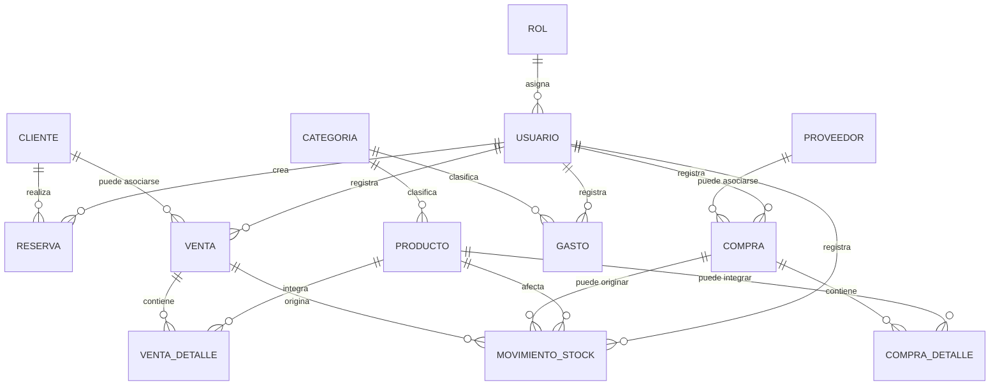

# Planificacion CRM Bodega - MVP

---

## 1. Resumen ejecutivo

**Problema que resuelve:** la informacion operativa y administrativa de la bodega puede quedar dispersa entre planillas, cuadernos, mensajes o la memoria del equipo. Esto dificulta saber rapidamente que reservas hay hoy, que clientes deben ser atendidos, que productos estan por agotarse, cuanto se vendio, que compras se realizaron y que gastos impactan en la gestion diaria.

El CRM Bodega centraliza esa informacion en un sistema web unico, con foco en la operacion diaria, la trazabilidad y la toma de decisiones.

**Usuarios principales:**

- **Administrador o dueno:** vision general del negocio, control operativo y administrativo.
- **Empleados:** uso diario segun permisos, por ejemplo reservas, clientes, ventas, compras, stock o gastos.

**Modulos principales del MVP:**

- Autenticacion.
- Dashboard.
- Clientes.
- Categorias.
- Productos.
- Reservas.
- Compras.
- Proveedores.
- Stock.
- Ventas.
- Gastos.
- Reportes.
- Usuarios.
- Configuracion.

Las operaciones comerciales del sistema se organizan mediante **Ventas**, **Compras** y **Gastos**. No existe un modulo funcional generico de Ingresos independiente.

**Fuera del MVP:** facturacion electronica, integraciones con medios de pago, notificaciones automaticas, contabilidad completa, produccion enologica, trazabilidad de elaboracion, multiples sucursales, app movil nativa, inteligencia artificial y reportes predictivos.

---

## 2. Stack aprobado

### Frontend

- React.
- Vite.
- JavaScript.
- Tailwind CSS.

### Backend

- NestJS.
- Prisma.
- PostgreSQL.
- Supabase como proveedor gestionado de PostgreSQL.

Supabase se utiliza unicamente para alojar la base de datos PostgreSQL mediante `DATABASE_URL`. No se utiliza Supabase Auth, Supabase Storage, Supabase Edge Functions ni Row Level Security como reemplazo de la autorizacion del backend.

---

## 3. Alcance del MVP

El MVP debe cubrir los modulos definidos por el roadmap aprobado:

0. Bootstrap.
1. Autenticacion.
2. Dashboard.
3. Clientes.
4. Categorias.
5. Productos.
6. Reservas.
7. Compras y Proveedores.
8. Stock.
9. Ventas.
10. Gastos.
11. Reportes.
12. Usuarios.
13. Configuracion.
14. Produccion y despliegue.

La etapa **Produccion y despliegue** se refiere a preparar y desplegar la aplicacion. No implica gestionar produccion de vino, lotes, fermentacion, barricas, cosechas ni procesos enologicos.

### Imprescindible para el MVP

- Login y autorizacion basica por rol.
- Dashboard operativo segun rol.
- Gestion de clientes.
- Gestion de categorias.
- Gestion de productos.
- Gestion de reservas.
- Gestion de proveedores.
- Gestion de compras.
- Stock calculado mediante movimientos.
- Gestion de ventas.
- Gestion de gastos.
- Reportes basicos de ventas, compras, gastos y stock.
- Gestion basica de usuarios.
- Configuracion general del sistema.

### Mejoras futuras

- Exportacion de informacion o reportes a CSV, Excel u otros formatos.
- Facturacion electronica.
- Integracion con medios de pago.
- Notificaciones automaticas por WhatsApp o email.
- Adjuntar comprobantes a gastos o compras.
- Gestion de mesas fisicas del restaurante.
- Permisos granulares avanzados.
- Reportes predictivos.
- Busqueda global y atajos globales.
- Guardado progresivo o recuperacion de formularios incompletos.
- App movil nativa.

---

## 4. Supuestos funcionales

| # | Tema | Decision funcional |
|---|---|---|
| 1 | Capacidad por turno | Configurable por tipo de reserva. El valor inicial recomendado para degustaciones es 20 personas por turno. |
| 2 | Duracion de degustacion | 90 minutos por defecto, editable desde configuracion. |
| 3 | Restaurante | En el MVP no se modelan mesas individuales; se gestiona capacidad total por franja horaria. |
| 4 | Superposicion de reservas | El sistema valida la capacidad y muestra advertencia si se supera. Puede permitirse forzar segun permisos. |
| 5 | Cancelaciones | Una reserva cancelada cambia de estado, no se elimina. |
| 6 | Stock negativo | No se permite ninguna operacion que deje stock negativo. |
| 7 | Producto unico | Existe una unica entidad Producto para productos terminados e insumos. |
| 8 | Ventas | Venta reemplaza al concepto funcional de Ingreso. Una venta puede generar salidas automaticas de stock. |
| 9 | Compras | Las compras representan adquisiciones operativas y no siempre afectan inventario. |
| 10 | Gastos | Gastos se mantiene separado de Compras para egresos administrativos o financieros. |
| 11 | Clientes duplicados | Se advierte ante email o telefono ya existente, sin bloquear necesariamente la carga. |
| 12 | Borrado fisico | No se eliminan registros con historial relevante; se usan bajas logicas o estados. |
| 13 | Zona horaria y moneda | Zona horaria unica del negocio, default `America/Argentina/Buenos_Aires`; moneda unica ARS. |

### Compras y stock

Las compras representan adquisiciones operativas de la bodega, como insumos, productos, mantenimiento o servicios.

Una compra puede:

- incluir productos que controlan stock;
- incluir productos que no controlan stock;
- incluir conceptos o servicios escritos como texto libre.

Solo los items asociados a productos con `controlaStock` activo generan movimientos de entrada. No debe asumirse que toda compra incrementa automaticamente el stock.

---

## 5. Productos y categorias

Existe una unica entidad **Producto** para representar tanto productos terminados como insumos.

Ejemplos de productos:

- vinos;
- botellas;
- corchos;
- cajas;
- etiquetas;
- materias primas;
- insumos generales;
- productos de merchandising;
- productos gastronomicos.

Los productos deben poder distinguirse mediante propiedades funcionales equivalentes a:

- `tipoProducto`;
- `seVende`;
- `seCompra`;
- `controlaStock`.

No se deben crear modelos separados para vinos e insumos en esta etapa.

Las categorias se administran mediante un modulo propio y se relacionan con productos. Permiten ordenar el catalogo, facilitar busquedas y mejorar filtros operativos y reportes.

---

## 6. Stock

El modelo de inventario aprobado se basa en movimientos:

- El stock no se almacena como un valor editable directamente.
- El stock actual se calcula a partir de la suma de movimientos.
- Los movimientos de stock son inmutables.
- Un movimiento registrado no debe editarse ni eliminarse para corregir cantidades.
- Los errores se corrigen mediante nuevos movimientos correctivos.
- No se permite stock negativo.
- Todos los movimientos deben permitir identificar su origen.
- Deben registrarse usuario, fecha y origen de la operacion.

**MovimientoStock** debe contemplar conceptualmente:

- tipo de movimiento;
- cantidad;
- producto;
- fecha;
- usuario;
- origen;
- `origenId`;
- observaciones, cuando corresponda.

Los posibles origenes pueden incluir:

- venta;
- compra;
- correccion;
- ajuste inicial;
- otra operacion autorizada.

Las ventas generan automaticamente movimientos de salida para productos con `controlaStock` activo. Las compras generan movimientos de entrada solo para los items asociados a productos que controlan stock. Los movimientos manuales quedan reservados para ajustes iniciales, correcciones u otras operaciones autorizadas.

---

## 7. Ventas

El modulo **Ventas** representa las operaciones comerciales de salida de productos. Reemplaza cualquier referencia funcional previa al modulo generico de Ingresos.

Una venta debe:

- tener uno o mas productos;
- registrar cantidades;
- registrar precios;
- calcular subtotales y total;
- asociarse opcionalmente con un cliente;
- registrar usuario y fecha;
- generar automaticamente movimientos de salida para productos que controlan stock;
- impedir la operacion cuando no exista stock suficiente.

Conceptualmente incluye:

- **Venta**;
- **VentaDetalle**.

No se mantiene una entidad Ingreso independiente para el MVP.

---

## 8. Compras y proveedores

### Proveedores

El modulo **Proveedores** permite gestionar la informacion necesaria para identificar y contactar a quienes venden productos, insumos o servicios a la bodega.

La informacion conceptual puede incluir:

- nombre o razon social;
- telefono;
- email;
- direccion;
- CUIT u otro identificador fiscal, si corresponde;
- observaciones;
- estado activo/inactivo.

### Compras

Una compra debe:

- asociarse con un proveedor cuando corresponda;
- contener uno o mas items;
- permitir productos registrados;
- permitir conceptos o servicios de texto libre;
- registrar cantidades y precios;
- calcular subtotales y total;
- registrar fecha y usuario;
- generar entradas de stock solamente para productos con `controlaStock` activo.

Conceptualmente incluye:

- **Proveedor**;
- **Compra**;
- **CompraDetalle**.

Debe evitarse duplicar una misma operacion como compra y gasto sin una regla funcional explicita.

---

## 9. Reservas

El modulo **Reservas** forma parte del MVP y debe permitir:

- seleccionar o registrar un cliente;
- indicar fecha;
- indicar hora;
- indicar cantidad de personas;
- agregar observaciones;
- gestionar estados de la reserva;
- identificar reservas pendientes de confirmacion;
- consultar proximas reservas.

Cuando se seleccione un cliente existente, el sistema debe reutilizar sus datos y evitar que el usuario tenga que volver a escribir telefono, correo u otra informacion ya registrada.

Estados sugeridos:

- Pendiente.
- Confirmada.
- Completada.
- Cancelada.
- No asistio.

---

## 10. Gastos

El modulo **Gastos** se mantiene separado de Compras.

Los gastos representan egresos que se desea registrar para control administrativo o financiero. Pueden utilizar categorias frecuentes, por ejemplo:

- servicios;
- mantenimiento;
- limpieza;
- insumos;
- marketing;
- otros.

Una operacion no debe duplicarse como compra y gasto salvo que exista una regla funcional explicita que lo justifique.

---

## 11. Reportes

El modulo **Reportes** centraliza la informacion analitica del negocio.

Debe incluir principalmente:

- analisis de ventas;
- analisis de compras;
- analisis de gastos;
- informacion de stock;
- indicadores por periodo;
- filtros de fechas;
- informacion necesaria para la gestion del negocio.

Los graficos deben considerarse prioritariamente parte de Reportes y no el elemento principal del Dashboard.

La exportacion de reportes queda como mejora futura para el MVP.

---

## 12. Dashboard

Filosofia del modulo:

> El Dashboard debe responder en menos de cinco segundos como esta la bodega hoy.

El Dashboard debe priorizar informacion operativa, no analisis profundo. Los analisis detallados corresponden principalmente a Reportes.

### Secciones principales

**Indicadores:**

- reservas del dia;
- ventas del dia;
- gastos del dia;
- productos con stock bajo.

**Proximas reservas.**

**Alertas:**

- stock bajo;
- compras pendientes, cuando corresponda;
- reservas sin confirmar;
- otros eventos operativos relevantes.

**Actividad reciente.**

**Acciones rapidas:**

- nueva reserva;
- nueva venta;
- nuevo cliente;
- nueva compra;
- registrar gasto.

El Dashboard debe mostrar informacion segun el rol del usuario, priorizando lo necesario para su trabajo diario.

Perfiles de UX y permisos de referencia:

- **Administrador:** vision general, ventas, compras, gastos, stock y actividad reciente.
- **Recepcion o turismo:** reservas, confirmaciones, clientes y accesos rapidos relacionados.
- **Deposito:** stock, compras, movimientos y alertas de inventario.

Estos perfiles son referencias de experiencia y permisos. No agregan nuevos roles obligatorios al modelo actual.

---

## 13. Navegacion

El sistema debe utilizar un menu lateral organizado por areas funcionales:

**Dashboard**

**Operacion**

- Reservas.
- Ventas.
- Compras.
- Gastos.

**Inventario**

- Productos.
- Categorias.
- Stock.

**Gestion**

- Clientes.
- Proveedores.

**Analisis**

- Reportes.

**Administracion**

- Usuarios.
- Configuracion.

El menu debe respetar los permisos. El usuario solo debe ver los modulos para los cuales tenga autorizacion.

Rutas conceptuales:

- `/login`
- `/dashboard`
- `/clientes`
- `/categorias`
- `/productos`
- `/reservas`
- `/proveedores`
- `/compras`
- `/stock` o `/movimientos-stock`
- `/ventas`
- `/gastos`
- `/reportes`
- `/usuarios`
- `/configuracion`

Todas las rutas excepto `/login` requieren sesion valida. Las rutas sensibles requieren permisos acordes al rol.

---

## 14. Principios de formularios y uso del teclado

### Formularios

Principios generales de UX:

- Buscar antes de escribir.
- Autocompletar cuando exista informacion registrada.
- Reutilizar datos existentes.
- Calcular automaticamente importes derivados.
- Minimizar la cantidad de campos obligatorios.
- Evitar solicitar informacion que el sistema ya conoce.
- Utilizar selectores o buscadores en lugar de texto libre cuando corresponda.
- Mostrar validaciones de manera clara.

Ejemplos:

- **Venta:** buscar productos, mostrar stock disponible, ingresar cantidad, utilizar el precio definido, calcular subtotal y total.
- **Compra:** buscar proveedor, agregar productos o conceptos, ingresar cantidad y precio, calcular subtotal y total.
- **Reserva:** seleccionar cliente, reutilizar telefono y correo, completar solamente los datos propios de la reserva.

El guardado progresivo o recuperacion de formularios incompletos queda documentado como mejora futura, no como requisito del MVP.

### Uso del teclado

Estandar de UX:

- `Tab` recorre los campos en un orden logico.
- Los buscadores permiten navegar con flechas.
- `Enter` selecciona la opcion resaltada en un buscador.
- `Escape` cierra un modal o cancela una accion.
- Si existen cambios sin guardar, se debe solicitar confirmacion antes de cerrar.
- `Enter` no debe guardar accidentalmente un formulario si el foco se encuentra en un campo donde pueda generar una accion incorrecta.

Los atajos globales, como `Ctrl+N`, `Ctrl+S`, `Ctrl+F` o una busqueda global, quedan como mejora futura y no como requisito del MVP.

---

## 15. Historias de usuario

### 15.1 Autenticacion

**Objetivo:** permitir el acceso seguro al sistema y aplicar permisos segun rol.

**HU-AUT-01** Como usuario, quiero iniciar sesion con email y contrasena para acceder a las funciones autorizadas.

- Criterios: rechaza credenciales invalidas con mensaje claro; redirige al Dashboard tras login exitoso; mantiene sesion segun configuracion.

**HU-AUT-02** Como usuario, quiero cerrar sesion para proteger el acceso al sistema.

- Criterios: logout visible; invalida la sesion local; redirige a `/login`.

### 15.2 Dashboard

**Objetivo:** mostrar en pocos segundos el estado operativo del dia.

**HU-DAS-01** Como administrador, quiero ver reservas, ventas, gastos y stock bajo para entender como esta la bodega hoy.

- Criterios: muestra indicadores del dia, proximas reservas, alertas y actividad reciente segun permisos.

**HU-DAS-02** Como empleado, quiero ver acciones rapidas relacionadas con mi rol para operar sin navegar de mas.

- Criterios: muestra accesos permitidos; oculta modulos no autorizados.

### 15.3 Clientes

**Objetivo:** centralizar los datos de personas que reservan, compran o interactuan con la bodega.

**HU-CLI-01** Como empleado, quiero registrar un cliente nuevo para asociarlo a reservas o ventas.

- Criterios: valida datos obligatorios; advierte posibles duplicados por email o telefono.

**HU-CLI-02** Como empleado, quiero buscar clientes existentes para reutilizar sus datos.

- Criterios: permite buscar por nombre, telefono o email; muestra resultados claros.

**HU-CLI-03** Como usuario autorizado, quiero consultar la ficha de un cliente para ver sus datos e historial relevante.

- Criterios: muestra datos de contacto, observaciones, reservas y operaciones asociadas cuando corresponda.

### 15.4 Categorias

**Objetivo:** ordenar productos y gastos mediante clasificaciones administrables.

**HU-CAT-01** Como administrador, quiero crear categorias para clasificar productos.

- Criterios: nombre obligatorio; evita duplicados evidentes; permite activar o desactivar categorias.

**HU-CAT-02** Como usuario autorizado, quiero filtrar productos por categoria para encontrar informacion rapidamente.

- Criterios: los listados permiten filtrar por categoria activa.

### 15.5 Productos

**Objetivo:** gestionar una entidad unica para productos terminados e insumos.

**HU-PRO-01** Como administrador, quiero crear productos con tipo, categoria y comportamiento comercial para usarlos en compras, ventas y stock.

- Criterios: permite definir `tipoProducto`, `seVende`, `seCompra` y `controlaStock`; el stock inicial no se edita directamente.

**HU-PRO-02** Como usuario autorizado, quiero consultar el stock calculado de un producto para saber su disponibilidad.

- Criterios: el stock mostrado surge de movimientos; resalta stock bajo.

**HU-PRO-03** Como administrador, quiero desactivar productos para que no aparezcan en nuevas operaciones sin borrar su historial.

- Criterios: baja logica; mantiene relaciones historicas.

### 15.6 Reservas

**Objetivo:** gestionar visitas de restaurante o degustacion con estado y cliente asociado.

**HU-RES-01** Como empleado, quiero crear una reserva seleccionando un cliente existente o registrando uno nuevo.

- Criterios: pide fecha, hora, personas y observaciones opcionales; reutiliza datos del cliente existente.

**HU-RES-02** Como empleado, quiero confirmar reservas pendientes para organizar la atencion.

- Criterios: cambia de Pendiente a Confirmada; registra usuario y fecha de la operacion cuando corresponda.

**HU-RES-03** Como empleado, quiero consultar proximas reservas para preparar la operacion diaria.

- Criterios: permite filtrar por fecha y estado; identifica pendientes de confirmacion.

**HU-RES-04** Como empleado, quiero cancelar o marcar asistencia para mantener actualizado el historial.

- Criterios: usa estados; no elimina la reserva.

### 15.7 Proveedores

**Objetivo:** mantener los datos de contacto e identificacion de proveedores.

**HU-PRV-01** Como usuario autorizado, quiero registrar proveedores para asociarlos a compras.

- Criterios: permite nombre, contacto, identificacion fiscal y observaciones.

**HU-PRV-02** Como usuario autorizado, quiero buscar proveedores existentes al cargar una compra.

- Criterios: permite buscar y seleccionar proveedor sin reescribir datos.

### 15.8 Compras

**Objetivo:** registrar adquisiciones operativas y generar stock solo cuando corresponda.

**HU-COM-01** Como usuario autorizado, quiero registrar una compra con proveedor, items, cantidades y precios.

- Criterios: calcula subtotales y total; admite productos registrados y conceptos de texto libre.

**HU-COM-02** Como usuario autorizado, quiero que la compra genere entradas de stock solo para productos que controlan stock.

- Criterios: crea movimientos de entrada para esos items; no crea movimientos para servicios, conceptos libres o productos sin stock.

**HU-COM-03** Como administrador, quiero consultar compras por periodo o proveedor para controlar adquisiciones.

- Criterios: filtros por fecha, proveedor y estado cuando corresponda.

### 15.9 Stock

**Objetivo:** reflejar inventario mediante movimientos inmutables y trazables.

**HU-STO-01** Como usuario autorizado, quiero ver movimientos de stock para auditar entradas, salidas y correcciones.

- Criterios: lista fecha, producto, cantidad, tipo, usuario, origen y observaciones.

**HU-STO-02** Como usuario autorizado, quiero registrar un ajuste inicial o correccion para corregir inventario sin editar movimientos previos.

- Criterios: crea un nuevo movimiento; valida que el resultado no sea negativo.

**HU-STO-03** Como usuario autorizado, quiero recibir alertas de stock bajo para reponer a tiempo.

- Criterios: compara stock calculado con minimo definido en producto.

### 15.10 Ventas

**Objetivo:** registrar operaciones de venta con detalle de productos, importes y salida automatica de stock.

**HU-VEN-01** Como usuario autorizado, quiero crear una venta agregando productos y cantidades.

- Criterios: muestra stock disponible; calcula subtotales y total; permite cliente opcional.

**HU-VEN-02** Como sistema, quiero impedir ventas sin stock suficiente para mantener inventario consistente.

- Criterios: valida antes de guardar; no permite stock negativo; informa el producto sin disponibilidad.

**HU-VEN-03** Como sistema, quiero generar movimientos de salida al confirmar una venta.

- Criterios: genera movimientos solo para productos con `controlaStock`; registra usuario, fecha y origen.

### 15.11 Gastos

**Objetivo:** registrar egresos administrativos o financieros separados de compras.

**HU-GAS-01** Como usuario autorizado, quiero registrar un gasto con categoria, concepto, importe y fecha.

- Criterios: valida importe positivo; permite estado pagado o pendiente cuando corresponda.

**HU-GAS-02** Como administrador, quiero consultar gastos por periodo y categoria para controlar egresos.

- Criterios: filtros por fecha, categoria y estado.

### 15.12 Reportes

**Objetivo:** centralizar analisis de ventas, compras, gastos y stock.

**HU-REP-01** Como administrador, quiero analizar ventas por periodo para evaluar resultados.

- Criterios: filtros de fecha; totales e indicadores coherentes con ventas registradas.

**HU-REP-02** Como administrador, quiero analizar compras y gastos para entender egresos.

- Criterios: separa compras de gastos; permite comparar por periodo.

**HU-REP-03** Como usuario autorizado, quiero consultar informacion de stock para detectar productos bajos o movimientos relevantes.

- Criterios: muestra stock calculado y alertas.

### 15.13 Usuarios

**Objetivo:** administrar accesos al sistema.

**HU-USU-01** Como administrador, quiero crear usuarios para que el equipo opere el CRM.

- Criterios: email unico; rol obligatorio; contrasena con requisitos minimos.

**HU-USU-02** Como administrador, quiero desactivar usuarios para revocar accesos sin borrar historial.

- Criterios: baja logica; conserva operaciones realizadas.

### 15.14 Configuracion

**Objetivo:** administrar parametros generales sin modificar codigo.

**HU-CON-01** Como administrador, quiero configurar capacidades, duraciones y parametros generales del negocio.

- Criterios: cambios disponibles solo para usuarios autorizados; valores validados.

**HU-CON-02** Como administrador, quiero configurar datos generales de la bodega.

- Criterios: permite mantener informacion basica del negocio usada por la aplicacion.

---

## 16. Flujos principales

### Clientes

1. El usuario ingresa a Clientes.
2. Busca si el cliente ya existe.
3. Si existe, abre su ficha o lo selecciona para otra operacion.
4. Si no existe, carga los datos minimos y guarda.
5. El sistema advierte posibles duplicados sin borrar historial.

### Categorias

1. El usuario autorizado ingresa a Categorias.
2. Crea o edita una categoria.
3. El sistema valida nombre obligatorio y duplicados evidentes.
4. La categoria queda disponible para productos o gastos, segun corresponda.

### Productos

1. El usuario ingresa a Productos.
2. Carga nombre, categoria, tipo y propiedades funcionales.
3. Define si se vende, se compra y si controla stock.
4. El sistema guarda el producto sin permitir editar stock directo.
5. El stock se consulta a partir de movimientos.

### Reservas

1. El usuario entra a Reservas y selecciona Nueva reserva.
2. Busca un cliente existente o registra uno nuevo.
3. Completa fecha, hora, cantidad de personas y observaciones.
4. El sistema valida capacidad y muestra advertencias si corresponde.
5. Guarda la reserva con estado inicial Pendiente.
6. Luego puede confirmarse, completarse, cancelarse o marcarse como No asistio.

### Proveedores

1. El usuario ingresa a Proveedores.
2. Busca si el proveedor ya existe.
3. Crea o actualiza datos de contacto e identificacion.
4. El proveedor queda disponible para compras.

### Compras

1. El usuario entra a Compras y crea una nueva compra.
2. Selecciona proveedor cuando corresponda.
3. Agrega items con productos registrados o conceptos libres.
4. Carga cantidades y precios.
5. El sistema calcula subtotales y total.
6. Al guardar, genera movimientos de entrada solo para items asociados a productos con `controlaStock`.
7. Los items sin stock o de texto libre quedan registrados en la compra sin afectar inventario.

### Stock

1. El usuario consulta el historial de movimientos.
2. El sistema muestra movimientos con usuario, fecha, producto, cantidad, tipo y origen.
3. Para corregir un error, el usuario crea un nuevo movimiento correctivo.
4. El sistema valida que el resultado no deje stock negativo.
5. No se editan ni eliminan movimientos anteriores.

### Ventas

1. El usuario entra a Ventas y crea una venta.
2. Selecciona cliente opcional.
3. Busca productos y agrega cantidades.
4. El sistema muestra stock disponible y precios.
5. Calcula subtotales y total.
6. Antes de guardar, valida disponibilidad para productos con `controlaStock`.
7. Si hay stock suficiente, guarda la venta y genera movimientos automaticos de salida.
8. Si no hay stock suficiente, rechaza la operacion con mensaje claro.

### Gastos

1. El usuario entra a Gastos.
2. Carga fecha, categoria, concepto, importe y estado cuando corresponda.
3. El sistema valida datos obligatorios.
4. Guarda el gasto separado de compras.

### Dashboard

1. Al ingresar al sistema, el usuario ve indicadores del dia segun su rol.
2. El sistema muestra proximas reservas, alertas y actividad reciente.
3. Las acciones rapidas visibles dependen de permisos.

### Reportes

1. El usuario autorizado ingresa a Reportes.
2. Selecciona periodo y filtros.
3. El sistema muestra analisis de ventas, compras, gastos y stock.
4. Los datos provienen de las operaciones registradas y del stock calculado.

---

## 17. Mapa de pantallas

1. **Login:** formulario de email y contrasena.
2. **Dashboard:** indicadores operativos, proximas reservas, alertas, actividad reciente y acciones rapidas.
3. **Clientes:** listado, busqueda, alta, edicion y ficha.
4. **Categorias:** administracion de categorias.
5. **Productos:** listado, busqueda, alta, edicion, estado, categoria y stock calculado.
6. **Reservas:** listado por fecha/estado, alta, detalle, confirmacion, cancelacion y asistencia.
7. **Proveedores:** listado, busqueda, alta, edicion y baja logica.
8. **Compras:** listado, alta con detalle, proveedor, items, totales e impacto de stock cuando corresponda.
9. **Stock:** movimientos, filtros, stock calculado, alertas y correcciones.
10. **Ventas:** listado, alta con detalle, cliente opcional, totales y validacion de stock.
11. **Gastos:** listado, alta, categorias, estados y filtros.
12. **Reportes:** analisis por periodo de ventas, compras, gastos y stock.
13. **Usuarios:** administracion de usuarios y roles.
14. **Configuracion:** parametros generales del sistema y datos de la bodega.

---

## 18. Modelo de datos conceptual

El modelo conceptual minimo incluye:

- **Rol:** id, nombre, descripcion, permisos conceptuales.
- **Usuario:** id, nombre, email unico, password hash, rol, activo, fechas de auditoria.
- **Cliente:** id, nombre, apellido, telefono, email, ubicacion, observaciones, activo, fechas de auditoria.
- **Categoria:** id, nombre, tipo o ambito cuando corresponda, activo.
- **Producto:** id, nombre, categoria, `tipoProducto`, `seVende`, `seCompra`, `controlaStock`, precio de venta, costo estimado, stock minimo, activo.
- **Reserva:** id, cliente, fecha, hora, cantidad de personas, estado, observaciones, usuario creador, fechas de auditoria.
- **Proveedor:** id, nombre o razon social, contacto, email, telefono, direccion, identificacion fiscal, observaciones, activo.
- **Compra:** id, proveedor opcional, fecha, usuario, subtotal, total, observaciones, estado cuando corresponda.
- **CompraDetalle:** id, compra, producto opcional, descripcion libre opcional, cantidad, precio unitario, subtotal.
- **MovimientoStock:** id, producto, tipo de movimiento, cantidad, fecha, usuario, origen, `origenId`, observaciones.
- **Venta:** id, cliente opcional, fecha, usuario, subtotal, total, observaciones, estado cuando corresponda.
- **VentaDetalle:** id, venta, producto, cantidad, precio unitario, subtotal.
- **Gasto:** id, fecha, concepto, categoria, importe, medio de pago, estado, observaciones, usuario creador.

No existe una entidad **Ingreso** independiente en el MVP.

### Relaciones conceptuales



Este documento no define ni modifica el schema de Prisma ni migraciones. La implementacion fisica debe respetar este modelo conceptual cuando corresponda a cada etapa.

---

## 19. API REST conceptual

La API REST debe exponerse desde NestJS y ser consumida por el frontend. El frontend no debe conectarse directamente a Supabase.

Recursos conceptuales:

- `auth`
- `clientes`
- `categorias`
- `productos`
- `reservas`
- `proveedores`
- `compras`
- `stock` o `movimientos-stock`
- `ventas`
- `gastos`
- `reportes`
- `usuarios`
- `configuracion`
- `dashboard`

Endpoints orientativos:

- `POST /api/auth/login`
- `POST /api/auth/logout`
- `GET /api/dashboard`
- `GET /api/clientes`
- `POST /api/clientes`
- `GET /api/clientes/:id`
- `PUT /api/clientes/:id`
- `GET /api/categorias`
- `POST /api/categorias`
- `PUT /api/categorias/:id`
- `GET /api/productos`
- `POST /api/productos`
- `GET /api/productos/:id`
- `PUT /api/productos/:id`
- `GET /api/reservas`
- `POST /api/reservas`
- `GET /api/reservas/:id`
- `PUT /api/reservas/:id`
- `PATCH /api/reservas/:id/confirmar`
- `PATCH /api/reservas/:id/cancelar`
- `PATCH /api/reservas/:id/completar`
- `GET /api/proveedores`
- `POST /api/proveedores`
- `PUT /api/proveedores/:id`
- `GET /api/compras`
- `POST /api/compras`
- `GET /api/compras/:id`
- `GET /api/movimientos-stock`
- `POST /api/movimientos-stock`
- `GET /api/ventas`
- `POST /api/ventas`
- `GET /api/ventas/:id`
- `GET /api/gastos`
- `POST /api/gastos`
- `GET /api/reportes`
- `GET /api/usuarios`
- `POST /api/usuarios`
- `PATCH /api/usuarios/:id/desactivar`
- `GET /api/configuracion`
- `PUT /api/configuracion`

Errores comunes:

- `400` validacion.
- `401` no autenticado.
- `403` sin permiso.
- `404` no encontrado.
- `409` conflicto, por ejemplo stock insuficiente.

La definicion detallada de DTOs y contratos se realizara en las etapas de implementacion correspondientes.

---

## 20. Reglas de negocio

- No se permite stock negativo.
- El stock se calcula mediante movimientos.
- Los movimientos de stock son inmutables.
- Las correcciones de stock se realizan mediante nuevos movimientos correctivos.
- Las ventas generan salidas automaticas de stock para productos que controlan stock.
- Las compras generan entradas de stock solo para productos que controlan stock.
- Una compra puede incluir productos sin stock o conceptos libres sin afectar inventario.
- Las ventas deben validar disponibilidad antes de confirmarse.
- Cada operacion relevante debe registrar usuario, fecha y origen.
- El sistema debe aplicar permisos segun rol.
- El menu y las acciones visibles deben respetar autorizaciones.
- Las reservas no se eliminan fisicamente; se gestionan por estado.
- Los registros con relaciones historicas relevantes no deben eliminarse fisicamente.
- Las bajas logicas se aplican cuando corresponda.
- El backend debe validar reglas de negocio aunque el frontend tambien valide.
- Gastos y Compras son modulos separados; no se debe duplicar una operacion sin regla explicita.
- Configuracion y gestion de usuarios quedan restringidas a usuarios autorizados.

---

## 21. Validaciones

### Frontend

- Campos obligatorios.
- Formatos de email, fecha, hora y numeros positivos.
- Feedback inmediato y mensajes claros.
- Validacion de cantidades y precios.
- Validacion visual de stock disponible en ventas.

### Backend

- Repetir todas las validaciones criticas del frontend.
- Validar permisos y roles.
- Validar transiciones de estado.
- Validar capacidad de reservas.
- Validar stock suficiente.
- Validar que una compra genere movimientos solo cuando corresponda.
- Usar DTOs y `class-validator`.

### Base de datos

- Claves primarias y foraneas.
- Unicidad donde corresponda, por ejemplo email de usuario.
- Restricciones basicas de integridad.
- Persistencia de relaciones historicas.

---

## 22. Arquitectura aprobada

**Frontend:** SPA con React, Vite, JavaScript y Tailwind CSS. El frontend consume exclusivamente la API REST del backend. Las llamadas a la API deben centralizarse en servicios.

**Backend:** API REST con NestJS, TypeScript, Prisma y validacion mediante DTOs con `class-validator`. NestJS contiene logica de negocio, validaciones y autorizacion.

**Base de datos:** PostgreSQL. Prisma es la unica capa de acceso a datos. Las migraciones deben versionarse con Prisma durante las tareas de desarrollo que correspondan.

**Supabase:** proveedor gestionado de PostgreSQL. No reemplaza autenticacion, autorizacion ni logica de negocio.

**Autenticacion:** JWT con expiracion configurable, guards de NestJS para rutas protegidas y control por rol.

**Variables de entorno:** `DATABASE_URL`, `JWT_SECRET`, `JWT_EXPIRATION`, `PORT`, `CORS_ORIGIN`.

No se deben incorporar microservicios ni dependencias innecesarias para el MVP.

---

## 23. Estructura de carpetas conceptual

La estructura real del repositorio utiliza:

```text
CRM-bodega/
  01-backend/
  02-frontend/
  docs/
```

Backend:

```text
01-backend/
  src/
    auth/
    usuarios/
    clientes/
    categorias/
    productos/
    reservas/
    proveedores/
    compras/
    stock/
    ventas/
    gastos/
    reportes/
    dashboard/
    configuracion/
    common/
    prisma/
  prisma/
    schema.prisma
    migrations/
```

Frontend:

```text
02-frontend/
  src/
    components/
    context/
    hooks/
    layouts/
    pages/
    routes/
    services/
    styles/
    App.jsx
    main.jsx
```

---

## 24. Seguridad minima

- Login con email y contrasena.
- Contrasenas hasheadas con bcrypt.
- Tokens JWT con expiracion.
- Rutas protegidas en frontend y backend.
- Autorizacion por rol en endpoints sensibles.
- Validacion de entradas con DTOs y `class-validator`.
- CORS restringido al origen del frontend.
- Variables sensibles solo en `.env`, nunca en el repositorio.
- Auditoria funcional de usuario, fecha y origen en operaciones relevantes.

---

## 25. Datos de prueba sugeridos

- **Usuarios:** Maria Fernandez como administradora; Lucas Gomez como empleado.
- **Clientes:** Sofia Martinez, Carlos Rodriguez, John Smith, Ana Belen Torres.
- **Categorias:** Vinos, Insumos secos, Packaging, Gastronomia, Servicios, Marketing.
- **Productos:** Malbec Reserva 2021, Cabernet Franc 2022, Espumante Extra Brut, botellas, corchos, cajas, etiquetas, tabla de quesos regionales.
- **Proveedores:** proveedor de botellas, proveedor de insumos gastronomicos, servicio de mantenimiento.
- **Reservas:** degustacion para 4 personas manana 11:00; almuerzo para 2 personas hoy 13:00.
- **Compras:** compra de botellas con control de stock; servicio de mantenimiento sin impacto de stock.
- **Ventas:** venta de botellas y productos de degustacion.
- **Movimientos de stock:** ajuste inicial, entrada por compra, salida por venta, correccion.
- **Gastos:** servicios, limpieza, marketing.

---

## 26. Plan de implementacion y backlog

El orden funcional aprobado es:

0. Bootstrap.
1. Autenticacion.
2. Dashboard.
3. Clientes.
4. Categorias.
5. Productos.
6. Reservas.
7. Compras y Proveedores.
8. Stock.
9. Ventas.
10. Gastos.
11. Reportes.
12. Usuarios.
13. Configuracion.
14. Produccion y despliegue.

Segun `docs/development/progreso.md`, las etapas 0, 1 y 2 figuran finalizadas. No deben marcarse como pendientes en este documento.

### Etapas finalizadas

- **Etapa 0 - Bootstrap:** proyecto inicial, backend, frontend, Tailwind, Prisma, Supabase y estructura base.
- **Etapa 1 - Autenticacion:** login, JWT, roles, guards, pantalla de login, contexto de autenticacion, rutas protegidas y logout.
- **Etapa 2 - Dashboard:** layout principal, sidebar, header, dashboard inicial, navegacion, componentes reutilizables y responsive.

### Proximas etapas del backlog

- **Etapa 3 - Clientes:** modelo, backend, frontend, CRUD, validaciones, pruebas y documentacion.
- **Etapa 4 - Categorias:** modelo, backend, frontend, CRUD, validaciones, pruebas y documentacion.
- **Etapa 5 - Productos:** modelo, backend, frontend, CRUD, busquedas, validaciones, pruebas y documentacion.
- **Etapa 6 - Reservas:** modelo, backend, frontend, calendario o vistas por fecha, estados, confirmaciones, pruebas y documentacion.
- **Etapa 7 - Compras y Proveedores:** proveedores, compras, detalle de compra, flujo de compra e integracion condicionada con stock.
- **Etapa 8 - Stock:** movimientos, calculo automatico, correcciones mediante movimientos, alertas de stock bajo, historial y pruebas.
- **Etapa 9 - Ventas:** modelo, backend, frontend, flujo de venta, detalle de venta, integracion con stock y validaciones.
- **Etapa 10 - Gastos:** modelo, backend, frontend, CRUD, categorias, pruebas y documentacion.
- **Etapa 11 - Reportes:** indicadores, reportes, filtros y visualizaciones. La exportacion queda como mejora futura.
- **Etapa 12 - Usuarios:** gestion de usuarios, roles y permisos.
- **Etapa 13 - Configuracion:** datos de la bodega, configuraciones generales y parametros del sistema.
- **Etapa 14 - Produccion y despliegue:** variables de entorno, seguridad, optimizacion, deploy backend, deploy frontend, pruebas finales, documentacion final y release.

---

## 27. Riesgos y decisiones aprobadas

### Riesgos tecnicos

- El calculo de stock por movimientos puede requerir optimizaciones si crece mucho el volumen historico.
- La falta de auditoria podria dificultar la trazabilidad de operaciones.
- Permisos mal configurados pueden exponer informacion o acciones no autorizadas.
- Dependencias innecesarias pueden aumentar complejidad y mantenimiento.

### Riesgos funcionales

- Inconsistencia entre compras y movimientos si no se respeta `controlaStock`.
- Ventas sin disponibilidad si la validacion de stock falla o se omite.
- Correcciones de stock incorrectas si no se registran como movimientos trazables.
- Duplicacion entre compras y gastos si el criterio operativo no se comunica claramente.
- Crecimiento no controlado del alcance con funciones ajenas al MVP.
- Confundir produccion enologica con despliegue a produccion de la aplicacion.

### Decisiones aprobadas

- Existe una unica entidad Producto.
- El stock se calcula por movimientos.
- Los movimientos de stock son inmutables.
- Venta reemplaza Ingreso como modulo comercial.
- Compra no siempre afecta stock.
- Las compras generan movimientos solo cuando corresponde.
- El Dashboard se adapta segun rol.
- El menu se organiza por areas funcionales.
- Los formularios deben ser inteligentes, con busqueda y autocompletado.
- La produccion enologica queda fuera de alcance.

### Decisiones operativas a confirmar en implementacion

- Capacidad real por turno de restaurante y degustacion.
- Si la advertencia de capacidad debe poder forzarse y que roles pueden hacerlo.
- Que empleados pueden ver importes de ventas, compras y gastos.
- Si multiples sucursales seran necesarias en una version futura.

---

## 28. Fuera de alcance actual

Queda claramente fuera del alcance actual:

- produccion enologica;
- lotes de produccion;
- fermentacion;
- barricas;
- cosecha;
- trazabilidad de elaboracion;
- facturacion electronica;
- integracion con medios de pago;
- integraciones externas no aprobadas;
- multiples sucursales, hasta que se defina;
- notificaciones automaticas;
- app movil nativa;
- inteligencia artificial;
- funcionalidades no indicadas en el MVP.

La produccion enologica no debe confundirse con la etapa de produccion y despliegue de la aplicacion.

---

## 29. Criterios generales de aceptacion

### Funcionales

- El administrador puede iniciar sesion, ver el Dashboard, gestionar clientes, categorias, productos, reservas, proveedores, compras, stock, ventas, gastos, reportes, usuarios y configuracion.
- Los empleados acceden solo a los modulos permitidos por su rol.
- El Dashboard muestra informacion operativa segun rol.
- El menu muestra solo opciones autorizadas.
- Las reservas permiten cliente existente o nuevo, fecha, hora, cantidad de personas, observaciones y estados.
- Las ventas registran productos, cantidades, precios, subtotales y total.
- Las ventas generan salidas automaticas para productos que controlan stock.
- Las ventas se bloquean si no hay stock suficiente.
- Las compras registran proveedor cuando corresponda, items, cantidades, precios, subtotales y total.
- Las compras generan entradas de stock solo para productos con `controlaStock` activo.
- Los gastos se gestionan separados de compras.
- Los reportes muestran informacion de ventas, compras, gastos y stock por periodo.
- Los formularios reutilizan datos existentes y calculan importes derivados.

### Tecnicos

- Backend y frontend compilan sin errores al finalizar cada etapa implementada.
- Las rutas sensibles estan protegidas por autenticacion y rol.
- Las validaciones criticas existen en backend.
- Prisma es la unica capa de acceso a PostgreSQL.
- Supabase se usa solo como proveedor de base de datos.
- Las migraciones se ejecutan solo en tareas de implementacion que lo requieran.

### Auditoria y stock

- El stock se calcula mediante movimientos.
- Los movimientos de stock son inmutables.
- Las correcciones se registran con nuevos movimientos.
- No se permite stock negativo.
- Las operaciones relevantes registran usuario, fecha y origen.
- No se eliminan registros con relaciones historicas relevantes.

---

## 30. Primer prompt recomendado para Codex

```text
Quiero continuar el desarrollo del CRM Bodega siguiendo docs/planificacion-crm-bodega.md como fuente de verdad funcional.

Antes de implementar:
- leer docs/planificacion-crm-bodega.md;
- leer docs/development/progreso.md;
- respetar el roadmap aprobado;
- no agregar funcionalidades fuera del MVP;
- no modificar arquitectura sin confirmacion.

Implementar solamente la etapa o tarea solicitada, validar backend/frontend segun corresponda y reportar cambios realizados.
```
